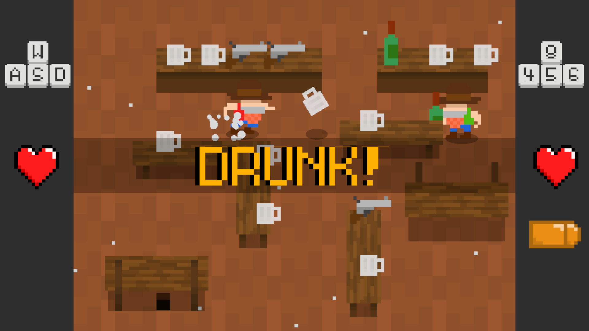

# William Towler - Portfolio

Experience programming games and software in C#, Python and the Unity game engine.

# Pixel Art Creator

# Saloon Switcheroo

A 2-player local versus game made in 48 hours for the 2020 GMTK Game Jam. Written in C# with Unity.

