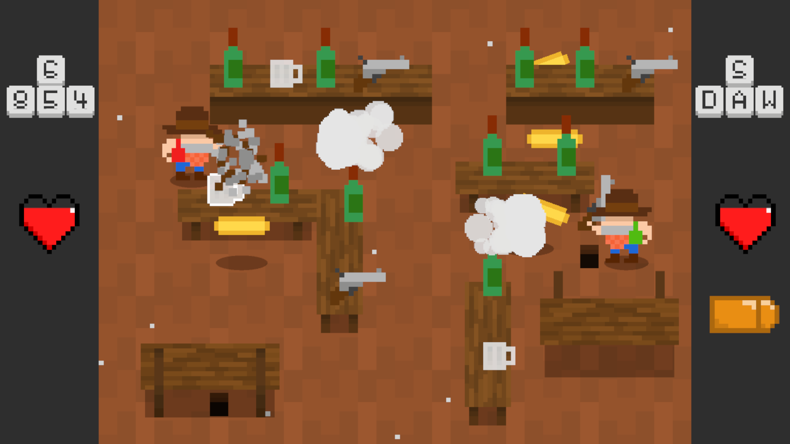

# Portfolio

Programming games and software in C#, Python and the Unity game engine.

Project titles include links to repositories.

# [Pixel Art Creator](https://github.com/MrWoafer/Pixel-Art-Creator-2.0)

_C#, Unity_

A program for making pixel art, including layers, animation and tilesets.

# [Saloon Switcheroo](https://github.com/MrWoafer/Saloon-Switcheroo)

_C#, Unity_

A 2-player local versus game made in 48 hours for the 2020 GMTK Game Jam.

# [Sight Singing Practice](https://github.com/MrWoafer/Sight-Singing-Practice)

_C#, Unity_

A program to help practise sheet music sight-singing through simple games. Includes a small custom music theory library.

# [Code Cracker](https://github.com/MrWoafer/Code-Cracker)

_GUI written in Python with tkinter; cipher crackers written in C#, and a few in C++_

A tool for automated solving of messages encrypted with classical ciphers. It primarily uses the approach of Simulated Annealing. Also includes statistical tests to help identify ciphers and can suggest possible cipher types for you.

